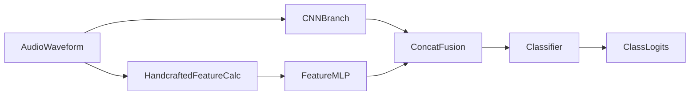

<!-- 6031afe5-809f-4041-8461-e7d8a2aee819 -->
---
todos:
  - id: "copy-feature-functions"
    content: "Перенести функции расчёта 5 фич в CNN-ноутбук"
    status: pending
  - id: "update-datasets-output"
    content: "Изменить Dataset/TestDataset, чтобы возвращали waveform + 5 фич"
    status: pending
  - id: "upgrade-cnn-model"
    content: "Сделать гибридную модель CNN + feature-branch с конкатенацией"
    status: pending
  - id: "patch-training-loops"
    content: "Обновить train/valid/test циклы под новые батчи и forward"
    status: pending
  - id: "patch-demo-inference"
    content: "Обновить демо/предсказание под передачу 5 фич"
    status: pending
isProject: false
---
# План интеграции 5 фич в CNN

## Что будет изменено
- Все изменения только в `DLS_Speech_HW/Homework_1_add_5_to_cnn.ipynb`.
- Из `DLS_Speech_HW/HW_1_RF_5_Feature_Model.ipynb` переносится блок вычисления 5 фич:
  - `energy_bursts_energy_ratio`
  - `energy_bursts_duration_mean`
  - `bp_energy_bursts_energy_ratio`
  - `amp_kurtosis`
  - `peaks_interval_mean`

## Изменения в датасете
- В ячейке с `SimpleAudioDataset` и `SimpleAudioTestDataset` добавить функции расчёта фич (из RF-ноутбука):
  - `_ensure_1d_float_waveform`, `_frame_signal`, `compute_peak_features`, `compute_energy_features`, `compute_amp_kurtosis`, `apply_time_filters`, `extract_waveform_features`.
- Обновить `__getitem__`:
  - для train/valid возвращать `(signal, extra_features, label)`
  - для test возвращать `(signal, extra_features, filename)`
- `extra_features` хранить как `torch.FloatTensor` фиксированной длины `5`.

## Изменения в модели
- Модифицировать `SoundClassificatonModel` в гибридную архитектуру:
  - CNN-ветка остаётся для `signal`.
  - Добавляется MLP-ветка для `extra_features` (5→hidden).
  - После этого выполняется конкатенация эмбеддингов двух веток и общий классификатор.
- Обновить `forward` сигнатуру на `forward(self, x_signal, x_features)`.

## Изменения в обучении/валидации/инференсе
- В циклах train/valid заменить распаковку батча:
  - было: `for signals, labels in train_loader`
  - станет: `for signals, features, labels in train_loader`
- Вызов модели заменить на `model(signals, features)` во всех местах.
- Аналогично обновить блок инференса на тесте и демо-класс `ESC50TestDemo`:
  - `predict_audio` будет принимать и waveform, и 5 фич, либо считать фичи внутри из waveform перед вызовом модели.

## Проверки после правок
- Проверить, что dataloader выдаёт тензор фич формы `[batch_size, 5]`.
- Проверить один батч через модель: выход `[batch_size, num_classes]`.
- Прогнать существующий train/valid цикл без ошибок сигнатур.
- Убедиться, что генерация предсказаний для test и `submission.csv` продолжает работать.

## Поток данных

## Ключевые точки в текущем ноутбуке
- Уже есть CNN-модель и train-loop, которые принимают только `signal`.
- Нужна синхронная правка трёх мест: Dataset → Model → Train/Inference loops, чтобы сигнатуры совпали.
- Блок функций фич уже готов в RF-ноутбуке и переносится почти без изменений, чтобы сохранить сопоставимость признаков.