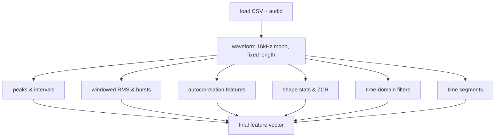

<!-- 0bb9a841-46bf-401b-a0eb-b3468e8a4bb1 -->
---
todos:
  - id: "hw1-features-1-3"
    content: "Добавить в HW_1_Feature_Construct.ipynb markdown-описание целей/ограничений и реализовать функции compute_peak_features и compute_energy_features."
    status: pending
  - id: "hw1-features-4-5"
    content: "Реализовать функции compute_autocorr_features и compute_shape_zcr_features и проверить их на одном клипе."
    status: pending
  - id: "hw1-features-6-7"
    content: "Реализовать time-domain фильтры и сегментационные признаки (apply_time_filters, compute_segment_features) и объединить их в extract_waveform_features."
    status: pending
  - id: "hw1-features-batch-demo"
    content: "(Опционально) Сделать небольшую батчевую обвязку: прогнать extract_waveform_features по части train_df и сохранить/проанализировать матрицу признаков."
    status: pending
isProject: false
---
## План реализации пп. 1–7 в HW_1_Feature_Construct.ipynb

### Краткая схема

### 1. Цели и ограничения (раздел 1 плана)
- Добавить в ноутбук markdown‑ячейку рядом с описанием задания, кратко фиксирующую:
  - цель фичей (улучшить качество, особенно recall для `dog` и `crying_baby`),
  - ограничение «работаем только с raw waveform, без спектрограмм»,
  - идею интеграции в будущем (отдельная MLP‑ветка + конкатенация), но без реализации на этом этапе.

### 2. Пиковые признаки (раздел 2 плана)
- В новой code‑ячейке определить функцию `compute_peak_features(waveform: np.ndarray, sr: int) -> dict`:
  - при необходимости нормализовать сигнал по амплитуде;
  - вычислить огибающую (например, `np.abs` + сглаживание через скользящее среднее);
  - найти локальные максимумы по огибающей с порогом по амплитуде и минимальным расстоянием в сэмплах;
  - по найденным пикам посчитать:
    - среднее и медиану расстояний между соседними пиками,
    - дисперсию расстояний,
    - количество пиков в секунду (count / duration),
    - среднюю и максимальную высоту пиков,
    - отношение средней/максимальной высоты пиков к среднему уровню огибающей.

### 3. Энергетические и огибающие признаки (раздел 3 плана)
- В той же или следующей ячейке реализовать `compute_energy_features(waveform, sr, win_ms=25, hop_ms=10) -> dict`:
  - перевести `win_ms` и `hop_ms` в сэмплы и разбить сигнал на окна;
  - вычислить RMS/энергию на каждом окне;
  - по вектору RMS собрать:
    - среднее, максимум, стандартное отклонение,
    - коэффициент вариации `std / mean` (с защитой от деления на ноль);
  - задать порог (например, `thr = mean + k * std`) и по RMS посчитать:
    - количество всплесков (подряд идущие окна выше порога),
    - среднюю и медианную длительность всплеска (в секундах),
    - долю энергии во всплесках `energy_peaks / energy_total`.

### 4. Периодичность и автокорреляция (раздел 4 плана)
- Добавить функцию `compute_autocorr_features(waveform, sr, window_sec=0.4) -> dict`:
  - взять одно окно по центру сигнала длиной `window_sec` (обрезать или паддить при необходимости);
  - вычислить автокорреляцию (через `np.correlate` или FFT‑подход) и нормализовать на значение при лаге 0;
  - найти первый значимый пик после нуля в диапазоне лагов, соответствующем разумным частотам (например, 50–1000 Гц);
  - сохранить:
    - лаг первого пика (в сэмплах и/или в Гц),
    - высоту этого пика (нормированная автокорреляция),
    - количество пиков автокорреляции выше заданного порога.

### 5. Статистика формы сигнала и ZCR (раздел 5 плана)
- Реализовать `compute_shape_zcr_features(waveform, sr, win_ms=25, hop_ms=10) -> dict`:
  - по всему клипу вычислить моменты распределения амплитуд: среднее, std, skewness, kurtosis
    (можно через `scipy.stats` или руками по формулам);
  - по тем же окнам, что и для энергии, посчитать ZCR:
    - `zcr_t = mean( sign(signal[t] * signal[t+1]) < 0 )` в каждом окне;
  - агрегировать ZCR по клипу: среднее, std, минимум, максимум.

### 6. Многомасштабные time‑domain фильтры (раздел 6 плана)
- Добавить функцию `apply_time_filters(waveform, sr) -> dict` или возвращающую промежуточные сигналы:
  - задать несколько фиксированных FIR/IIR‑фильтров (low‑pass, 1–2 band‑pass, high‑pass) с помощью `scipy.signal` или `torchaudio.functional`;
  - для каждого фильтрованного сигнала вызвать уже реализованные энергетические и ZCR‑функции (подмножество признаков),
    добавляя префикс к именам признаков (`lf_`, `bp1_`, `bp2_`, `hf_`).

### 7. Временная структура (сегментация клипа, раздел 7 плана)
- Реализовать `compute_segment_features(waveform, sr, num_segments=3) -> dict`:
  - разбить сигнал на `num_segments` равных по длительности частей;
  - в каждом сегменте посчитать простые признаки: энергию (RMS), количество пиков, ZCR (можно вызвать уже написанные функции на сегменте);
  - затем агрегировать по сегментам: для каждого признака взять минимум, максимум и среднее по сегментам
    (например, `seg_energy_mean_min`, `seg_energy_mean_max`, `seg_zcr_mean_mean`).

### 8. Унифицированная функция извлечения фичей для одного клипа
- Создать функцию `extract_waveform_features(waveform, sr) -> Tuple[np.ndarray, List[str]]`, которая:
  - вызывает все вышеперечисленные `compute_*` функции,
  - собирает их результаты в один словарь,
  - фиксирует порядок признаков и возвращает вектор `np.float32` и список имён фичей.
- Добавить небольшую демонстрацию на одном/нескольких примерах из `train_df` с выводом размера вектора фичей
  и части значений/имён признаков для проверки.

### 9. Подготовка к батчевой обработке (без полной интеграции в модель)
- При необходимости (если хотите сразу готовить датасет признаков) добавить ячейку:
  - функция, которая по `train_df`/`valid_df` циклом:
    - загружает waveform через уже готовый `SimpleAudioDataset` или напрямую `torchaudio.load` + препроцессинг,
    - применяет `extract_waveform_features`,
    - собирает матрицу `X_features` и вектор меток `y`;
  - сохранить `X_features` и `y` в `.npy`/`.pt` файлы для дальнейших экспериментов (пункты 8–10 плана будут использовать эти данные).

### 10. Минимальные проверки корректности
- В ноутбуке добавить короткие проверки:
  - отсутствие `NaN`/inf в итоговом векторе фичей;
  - разумные масштабы значений (через `describe()` по матрице фичей для небольшого поднабора);
  - временную сложность: убедиться, что полный проход по `train_df` занимает приемлемое время на вашей машине.
